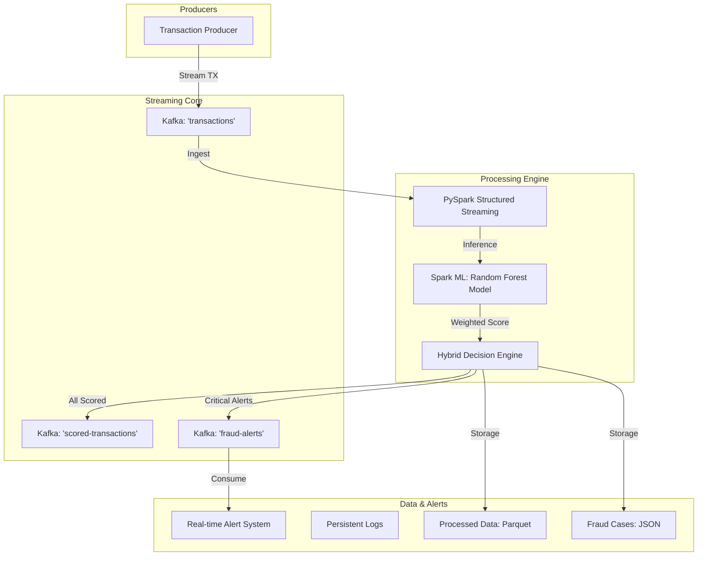

# SmartOps — AI-Powered Fraud Detection Platform

SmartOps is a professional, production-grade real-time fraud detection platform designed for high-velocity financial transactions. It leverages a hybrid intelligence approach, combining heuristic rules with machine learning to identify and alert on suspicious activities in milliseconds.

---

## 🏗️ Architecture



---

## ✨ Key Features

## ✨ Key Features  

### Released Features  
- **Real-Time Data Pipeline** using Kafka (KRaft mode)  
- **Fraud Detection Engine** (ML + rule-based scoring)  
- Real-time `fraud_probability` and `risk_level`  
- **Feature Engineering** (amount, time, high-value flags)  
- **Fraud Simulation** (velocity attacks & abnormal patterns)  
- **Dual Storage**:  
  - Parquet (analytics)  
  - JSON (fraud cases)  
- **Microservices Foundation** (ingestion, scoring, alerts)  

---

### Future Features  
- Full **MLOps pipeline** (MLflow + Azure ML + model versioning)  
- **Kubernetes deployment (AKS)** with auto-scaling  
- Advanced **CI/CD pipeline** (GitHub Actions + ArgoCD)  
- **API Gateway & Case Management system**  
- **Monitoring & Observability** (Prometheus, Grafana, ELK, Jaeger)  
- **Service Mesh (Istio)** for security and traffic control  
- Enhanced **Security** (mTLS, RBAC, Key Vault)  

---

## 🛠️ Tech Stack

- **Core Engine**: Apache Spark 4.1.1 (Structured Streaming + MLlib)
- **Messaging**: Apache Kafka (KRaft mode)
- **Intelligence**: Spark ML (Random Forest Classifier)
- **Language**: Python 3.12
- **Infrastructure**: Docker & Docker Compose
- **Monitoring**: Python Logging + Kafka Alert Consumer

---

## 🏁 Getting Started

### 1. Prerequisites
- Docker & Docker Compose installed
- Python 3.12+ (if running scripts locally)
- Java 17+ (required for local Spark)

### 2. Environment Setup
```bash
# Clone the repository and enter the directory
python3 -m venv venv
source venv/bin/activate
pip install -r requirements.txt
```

### 3. Initialize Intelligence (Model Training)
Ensure you have the model trained before starting the ingestion service.
```bash
python models/train_model.py
```

---

## Execution Guide

Follow this order to run the full platform in dedicated terminal windows:

### Step 1: Start Infrastructure
```bash
docker compose up -d
```

### Step 2: Start target Alert System
Listen for real-time fraud detections.
```bash
python services/alert-service/alert_consumer.py
```

### Step 3: Start Transaction Producer
Generates live traffic with periodic velocity attacks.
```bash
python services/transaction-producer/producer.py
```

### Step 4: Run Ingestion & Intelligence
Launch the Spark streaming job.
```bash
bash scripts/submit_spark.sh
```

---

## 📊 Data & Monitoring

### 📁 Output Paths
- **Full Dataset**: `/data/processed/` (Parquet)
- **Fraud Alerts**: `/data/fraud_cases/` (JSON)
- **Application Logs**: `/logs/ingestion_service.log`
- **System Alerts**: `/logs/alerts.log`

### ⚙️ Configuration (`.env`)
You can tune the system sensitivity via the `.env` file:
- `ML_WEIGHT`: Weight given to the ML score (0.0 to 1.0)
- `FRAUD_THRESHOLD`: Minimum aggregate score to trigger an alert.
- `PRODUCER_VELOCITY_PROBABILITY`: Probability of a bot attack burst.

---

## 🗺️ Roadmap
- [ ] **Phase 4**: Migration to Kubernetes (EKS/GKE) with Helm for elastic scaling.
- [ ] **Phase 5**: Advanced Stateful Features (Moving window aggregations for user profiling).
- [ ] **Phase 6**: Streamlit Real-Time Dashboard for SOC analysts.

---
*Built with ❤️ by SmartOps Engineering Team.*
